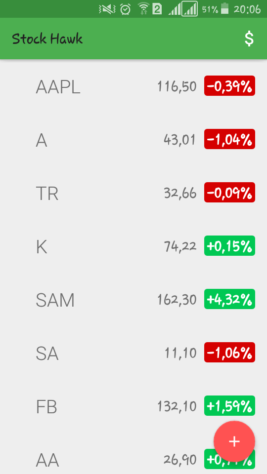
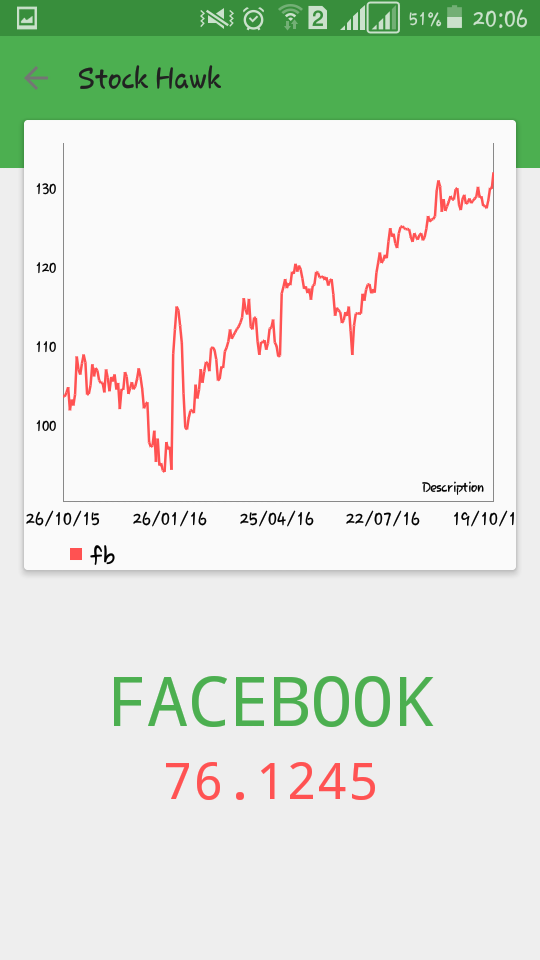
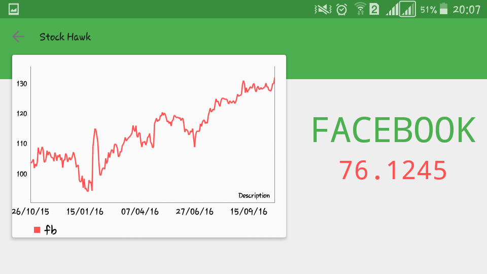
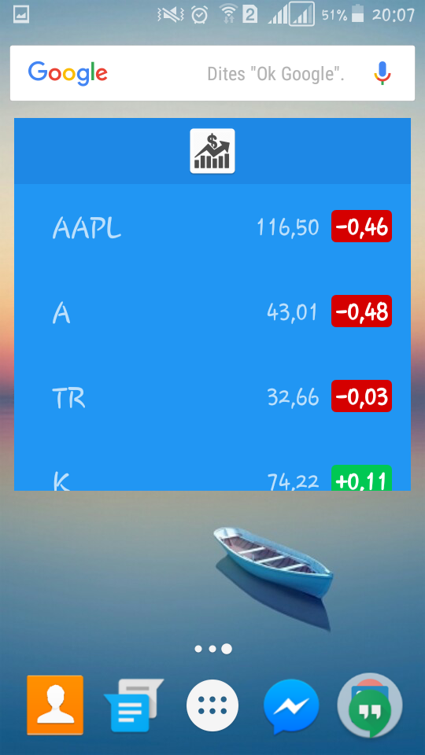

# StockHawk
Udacity - Android Developer Nanodegree - Projects 3: Stock Hawk

Stock Hawk project gives an opportunity to diagnose problems and practice improving apps. These skills are vital to building apps users will love. Diagnosing issues with existing apps is key to working on large apps or continuing projects in Android. Being aware of the common pitfalls in app design frees a developer to produce novel app experiences without making the same mistakes over and over.

# Project Specification
<ul>
<li>Each stock quote on the main screen is clickable and leads to a new screen which graphs the stock's value over time.</li>
<li>Stock Hawk does not crash when a user searches for a non-existent stock.</li>
<li>Stock Hawk Stocks can be displayed in a collection widget.</li>
<li>Stock Hawk app has content descriptions for all buttons.</li>
<li>Stock Hawk app supports layout mirroring using both the RTL attribute and the start/end tags.</li>
<li>Strings are all included in the strings.xml file and untranslatable strings have a translatable tag marked to false.</li>
</ul>
#Libraries
<li>OkHttp</li>
<li>Schematic</li>
<li>FloatingActionButton</li>
<li>MaterialLoadingProgressBar</li>
<li>MPAndroidChart</li>
<li>Material Design</li> 
</ul>
